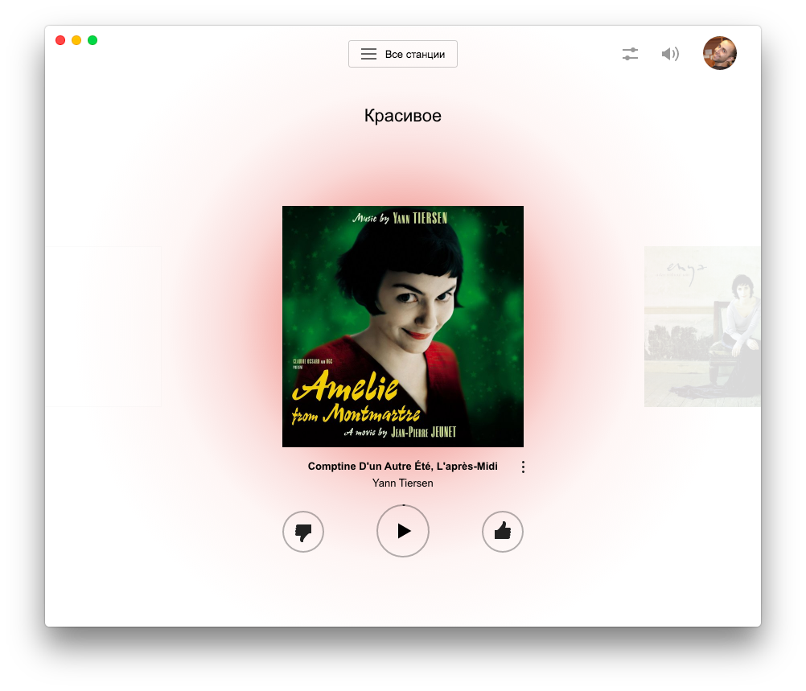
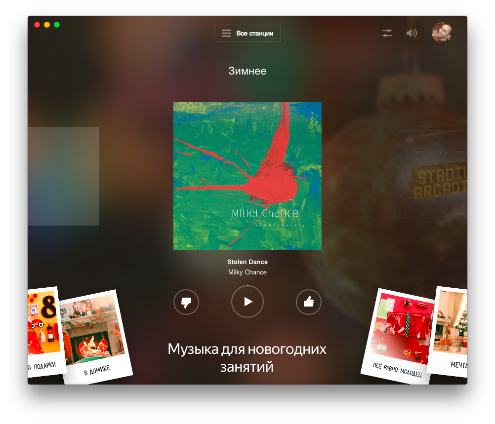

# YaRadio 

Unofficial Desktop app for [Yandex.Radio](https://radio.yandex.ru/) with global media hotkeys support.


### Install
*Mac OS 10.9+, Windows 7+ and Linux are supported.*
#### Mac OS
[**Download**](https://github.com/maxvipon/yaradio/releases/latest), unzip, and move `YaRadio.app` to the `/Applications` directory.
#### Linux
[**Download**](https://github.com/maxvipon/yaradio/releases/latest) and unzip to some location.  
To add a shortcut to the app, create a file in `~/.local/share/applications` called `YaRadio.desktop` with the following contents:
```
[Desktop Entry]
Name=YaRadio
Exec=/full/path/to/folder/YaRadio
Terminal=false
Type=Application
Icon=/full/path/to/folder/YaRadio/resources/app/static/Icon.png
```
#### Windows
[**Download**](https://github.com/maxvipon/yaradio/releases/latest) and unzip to some location.
### Related
* [yam](https://github.com/artemeff/yam) – Yandex.Music app
* [yaradio](https://github.com/maxvipon/yaradio) - Yandex.Radio app
---
### Dev
Built with [Electron](http://electron.atom.io).
###### Commands
- Init: `$ npm install`
- Run: `$ npm start`
- Build macOS: `$ npm run build:macos`
- Build Linux: `$ npm run build:linux`
- Build Windows: `$ npm run build:windows` (for *macOS* wine is required `$ brew install wine`)
- Build all: `$ npm run build`
# License
MIT © [Maxim Ponomarev](https://github.com/maxvipon/)
